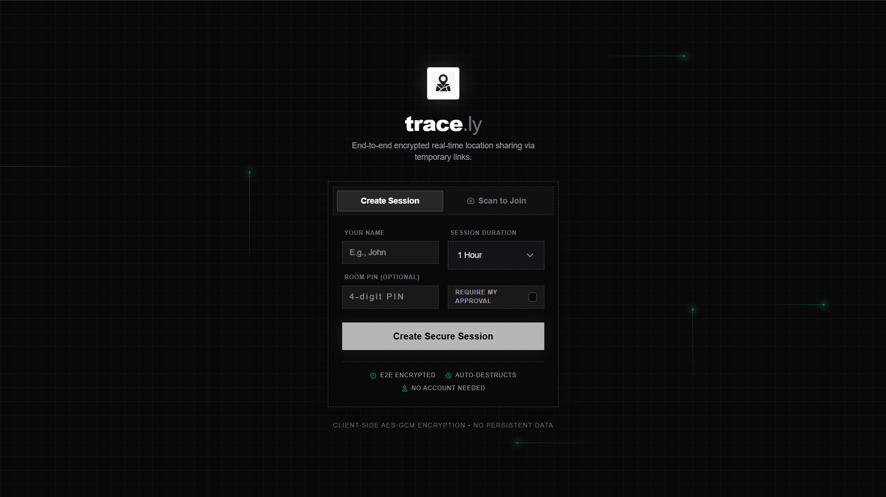

# trace.ly

**trace.ly** is a privacy-focused real-time location sharing platform designed for temporary tracking sessions. It enables users to create secure rooms, share live location through QR codes or invite links, and visualize participants on an interactive map — all while maintaining strong end-to-end encryption.

The system uses WebSockets for real-time communication, a hybrid caching layer for ultra-fast performance, Redis for scalable state management, and client-side cryptography to ensure location data remains private.

[](https://tracely-rt.vercel.app)

## ✨ Features

* **Real-Time Location Sharing**: Instantly broadcast and receive live location updates across all participants in a room.
* **End-to-End Encryption**: Location payloads are encrypted with AES-GCM and signed using HMAC to prevent tampering.
* **Hybrid Caching Layer**: Utilizes an in-memory Node.js cache in front of Redis to minimize database commands and achieve sub-millisecond room verifications.
* **Zero-Latency Rate Limiting**: In-memory server-side protections to prevent abuse, spam location updates, and database overloading.
* **QR Code Room Access**: Quickly invite participants by sharing a link or scanning a generated QR code.
* **Interactive Map Tracking**: Smoothly animated location markers rendered using Leaflet with automatic map following.
* **Session Expiry System**: Rooms automatically expire after a chosen duration (1–24 hours) for enhanced privacy.
* **Pocket Mode**: Battery-saving mode that disables map rendering while continuing location broadcasts.
* **Presence Detection**: Detect when participants go offline or disconnect from the session.
* **Scalable Infrastructure**: Redis-powered room state management with Socket.IO clustering support.
* **Mobile-Optimized Interface**: Responsive UI with a draggable mobile sidebar and intuitive controls.

## 🏗️ Architecture Overview

```text
Client (Next.js)
      │
      │  encrypted location payloads
      ▼
Socket.IO WebSocket Server (Node.js)
      ├── In-Memory Rate Limiter (Zero-latency DDoS protection)
      ├── In-Memory Room Cache (Ultra-fast lookups)
      │
      ▼
Redis (Persistent Room State + Cross-instance Presence)
      │
      ▼
Broadcast encrypted payloads to room participants

```

**Important design choice**

The server **never decrypts location data**.

Encryption keys exist **only inside the browser**, ensuring true end-to-end encryption.

## 🛠️ Tech Stack

### Frontend

* **Framework**: [Next.js](https://nextjs.org/) (App Router)
* **Language**: [TypeScript](https://www.typescriptlang.org/)
* **Styling**: [Tailwind CSS v4](https://tailwindcss.com/)
* **Maps**: [Leaflet](https://leafletjs.com/) + [React Leaflet](https://react-leaflet.js.org/)
* **Animations**: [Framer Motion](https://www.framer.com/motion/)
* **Realtime Communication**: [Socket.IO Client](https://socket.io/)
* **QR Code Generation**: [qrcode.react](https://github.com/zpao/qrcode.react)
* **QR Code Scanner**: [html5-qrcode](https://github.com/mebjas/html5-qrcode)

### Backend

* **Runtime**: [Node.js](https://nodejs.org/)
* **Framework**: [Express](https://expressjs.com/)
* **WebSockets**: [Socket.IO](https://socket.io/)
* **Database**: [Redis](https://redis.io/) with [ioredis](https://github.com/redis/ioredis)
* **Caching Layer**: Node.js In-Memory `Map()` caching for rapid rate-limiting and room state retrieval.
* **Scaling Adapter**: Socket.IO Redis Adapter
* **Security**: Helmet + Express Rate Limit

### Cryptography

* **Encryption**: AES-256-GCM
* **Integrity Verification**: HMAC-SHA256
* **Browser API**: Web Crypto API

## 🚀 Getting Started

Follow these steps to run the project locally.

### 1. Clone the repository

```bash
git clone https://github.com/riki-k-dev/trace.ly.git
cd trace.ly

```

### 2. Install dependencies

Install client dependencies:

```bash
cd client
pnpm install

```

Install server dependencies:

```bash
cd server
pnpm install

```

### 3. Configure environment variables

Create `.env` files.

**Client**

```
NEXT_PUBLIC_SOCKET_URL=http://localhost:5000

```

**Server**

```
PORT=5000
CLIENT_URL=http://localhost:3000
REDIS_URL=redis://localhost:6379

```

### 4. Start Redis

Make sure Redis is running locally.

```bash
redis-server

```

### 5. Start the backend server

```bash
cd server
pnpm run dev

```

### 6. Start the frontend

```bash
cd client
pnpm run dev

```

### 7. Open the application

Visit:

```
http://localhost:3000

```

Create a room and share the generated QR code or link to begin tracking.

## 📂 Project Structure

```text
tracely/
│
├── client/                 # Next.js frontend
│   ├── app/                # App router pages
│   ├── components/         # UI components
│   │   ├── map/            # Map rendering components
│   │   ├── room/           # Room interface UI
│   │   └── ui/             # Toasts and shared UI
│   │
│   ├── hooks/              # Custom React hooks
│   ├── lib/                # Crypto + socket utilities
│   └── globals.css         # Global styles
│
├── server/                 # Node.js backend
│   ├── config/             # Environment configuration
│   ├── rooms/              # Redis room management logic
│   ├── sockets/            # Socket.IO handlers
│   ├── utils/              # Helper utilities
│   └── server.js           # Express + Socket.IO entry
│
└── README.md

```

## 🔐 Security Design

trace.ly was built with a **privacy-first architecture**.

Key protections include:

* **Client-side encryption** ensures location coordinates are never readable by the server.
* **HMAC signatures** prevent malicious payload tampering.
* **Ephemeral session keys** stored only in browser session storage.
* **Automatic room expiration** ensures data does not persist longer than necessary.
* **Rate-limited messaging** protects against flooding attacks.

## 📈 Scalability

The architecture supports horizontal scaling through:

* Redis Pub/Sub for Socket.IO
* Stateless Node.js instances
* Distributed presence tracking
* Server-side rate limiting

This allows trace.ly to scale across multiple backend instances while maintaining real-time synchronization.

## 🎯 Use Cases

* Temporary group travel tracking
* Hiking / outdoor safety coordination
* Event coordination
* Friend meetups in crowded areas
* Private short-term location sharing

## 📜 License

This project is licensed under the **MIT License**.
